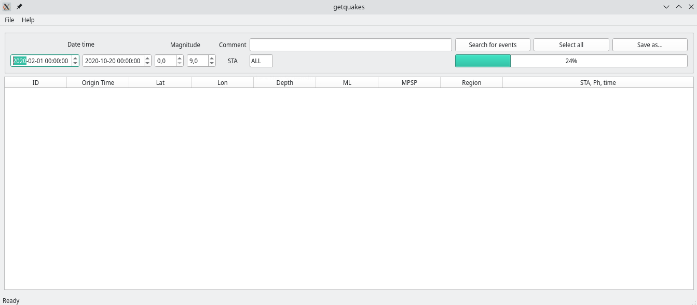

# getquakes

Кросплатформенное графическое приложение для получения информации и формирования отчетов о зарегистрированных землетрясениях и их параметрах.

## Основные функции приложения:
- получениe информации из локальной базы данных по заданным параметрам,
- отображение полученной информации в виде таблицы (одна строка - одно землетрясение) с возможностью сортировки по столбцам,
- сохранение выбранных в таблице землетрясений в файлы с различной структурой и расширением для дальнейшего использования.

## Проект реализован на стэке:
- Qt Designer, PySide6;
- Mysql-connector;
- Python.

## Установка приложения:
1. если в системе не установлен python, устанавливаем его (работа приложения проверена для python 3.8.9+)
2. скачиваем архив
3. распаковываем в нужную нам папку
4. из этой папки открываем командную строку (терминал)
5. если хотим изолировать библиотеки для выполнения приложения, устанавливаем виртуальное окружение, командой в терминале:
	- `python -m venv venv`
	-  если нет, сразу переходим к пункту 7
6. активируем виртуальное окружение:
   - linux: `source venv/bin/activate`
   - windows: `venv\Scripts\activate.ps1`
7. устанавливаем зависимости:
   - `python -m pip install -r requirements.txt`
8. запускаем скрипт и открывается главное окно программы: 
   - `python getquakes.py`
   
